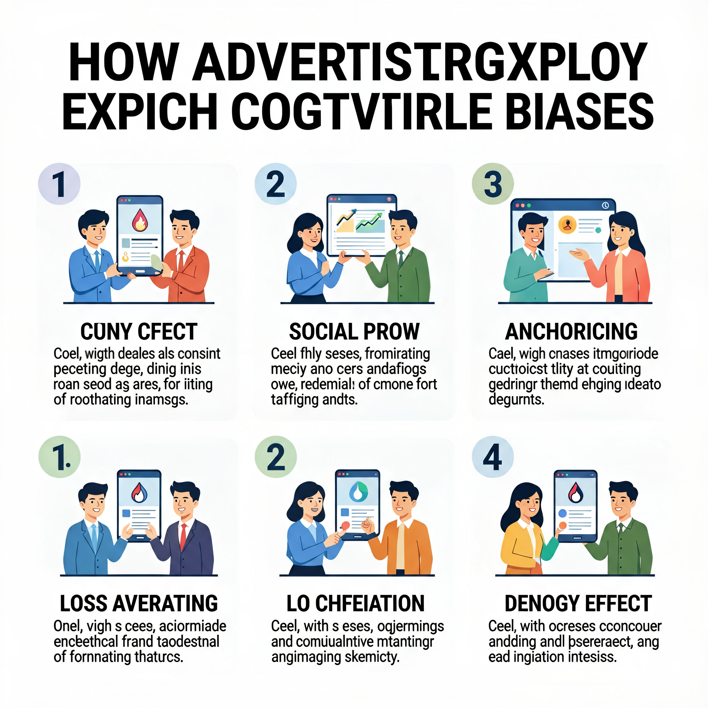
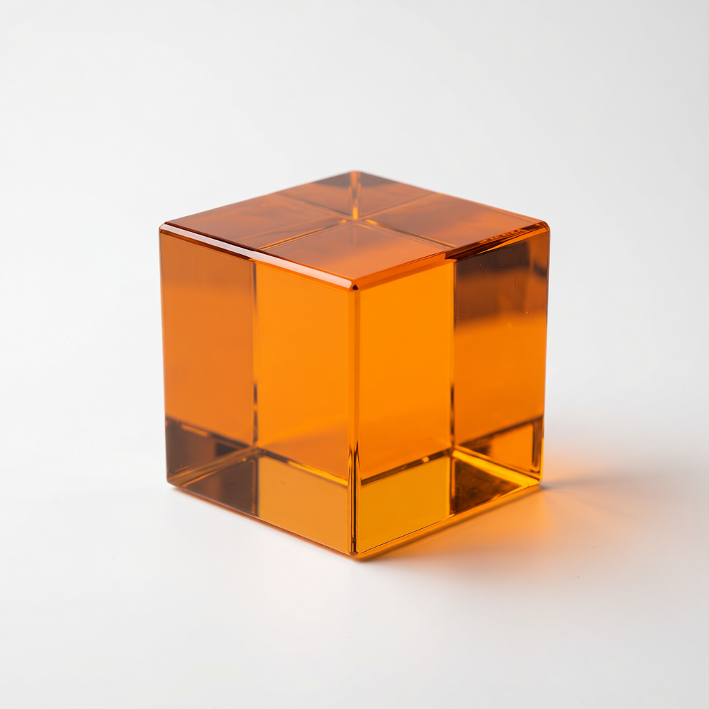

# agnes-image-gen

Agnes Image 2.1 Flash 图像生成 skill，支持文生图、图生图和多图合成。

官方文档：https://www.agnes-ai.com/

## 快速安装（小白版）

你有两种方式把这个技能装到自己的电脑上，任选其一。

### 方式一：直接下载 `.skill` 压缩包（最简单）

1. 下载文件：`dist/agnes-image-gen.skill`（点它 → 右上角"下载"按钮，或者右键另存为）
2. 找到你电脑上的技能文件夹，一般是 `~/.agents/skills/`（`~` 就是你自己的用户主目录）
3. 把这个 `.skill` 文件**解压**到技能文件夹里：
   - Windows：右键 → 解压到当前文件夹（Windows 自带的解压就能打开，它本质是一个 zip 压缩包）
   - macOS：双击，或用"归档实用工具"打开
   - Linux：运行 `unzip agnes-image-gen.skill -d ~/.agents/skills/`
4. 解压后，你应该能看到 `~/.agents/skills/agnes-image-gen/SKILL.md` 这个文件
5. 重启你的 AI 工具，技能就能用了

### 方式二：直接克隆整个仓库（适合会 Git 的人）

```bash
git clone https://github.com/VastFuture/agnes-image-gen.git ~/.agents/skills/agnes-image-gen
```

## `.skill` 文件是什么？（小白必读）

`.skill` 就是一个**技能压缩包**，本质是一个 zip 压缩包，只是文件后缀叫 `.skill` 而已。

它把一整个技能文件夹（`SKILL.md` + 脚本 + 文档 + 示例图）打包成一个文件，方便你**下载、复制、发给别人、备份迁移**。

打个比方：
- **技能文件夹** = 一套已经组装好的乐高玩具
- **`.skill` 文件** = 把乐高装进盒子里打包好，方便运输
- 收到盒子的人拆开，就得到一套完整的技能

### 里面装了什么东西？

```
agnes-image-gen.skill
├── SKILL.md                    技能说明书（AI 靠它知道怎么用）
├── scripts/generate.py         生图脚本（真正干活的东西）
├── references/                 详细文档（API 参数、提示词指南）
└── assets/                     示例图片（看看能生成什么效果）
```

### 使用前需要准备什么？

需要两个前提条件：

1. **技能加载路径**：确保你的 AI 工具会从 `~/.agents/skills/` 加载技能（这是 opencode / Claude Code 等工具的通用约定）。
2. **API Key**：生图需要调用 Agnes AI 的服务，要设置一个环境变量 `AGNES_API_KEY`：
   - 从 https://www.agnes-ai.com/ 获取你的 API Key
   - 在终端里设置：`export AGNES_API_KEY="你的key"`（临时生效），或写进 shell 配置文件永久生效

### 怎么用这个技能？

装好之后，直接对你的 AI 助手说：

- "帮我生成一张图片，主题是……"
- "把这个图换成赛博朋克风格"
- "生成一张产品海报"

AI 会自动调用这个技能帮你生图。也可以手动运行脚本：

```bash
python3 scripts/generate.py "A cat astronaut on the moon" --size 2K --ratio 16:9 -o output.png
```

### 常见问题

**问：`.skill` 文件打不开？**
答：它本质是 zip。如果双击打不开，试试改后缀为 `.zip` 再解压，或用命令行 `unzip`。

**问：解压到哪里才对？**
答：解压到 `~/.agents/skills/` 下面，确保最终路径是 `~/.agents/skills/agnes-image-gen/SKILL.md`。

**问：装好了但是用不了？**
答：先检查 `AGNES_API_KEY` 有没有设置成功，输入 `echo $AGNES_API_KEY` 看看有没有输出你的 key。

**问：这个仓库和 `.skill` 文件有什么区别？**
答：仓库是"源文件"（给人看、给别人开发改进用的），`.skill` 是"打包好的成品"（给 AI 装到本地用的）。两者内容一样，二选一即可。

## 示例

### 文生图

**浮空城市**（2K / 16:9）：

```
A luminous floating city above a misty canyon at sunrise, cinematic realism, golden light, high detail
```


**VR 头显爆炸视图海报**（2K / 16:9）：

```
Vertical exploded view of a Meta Quest 3 VR headset, 9 stacked layers of internal components: outer shell, camera sensors, mainboard with chip, Pancake lenses, internal frame, battery pack, side straps, top head strap, facial interface pad. Clean high-tech 3D render, studio lighting, glowing accents, soft purple-blue gradient background, commercial poster layout
```


**成都吃货暴走地图**（2K / 16:9）：

```
Hand-drawn tourist map infographic of Chengdu on aged parchment, watercolor and ink illustration, vintage style, landmarks and food spots, giant panda centerpiece, retro compass, high visual density
```


**超市抓拍人像**（2K / 9:16 竖版）：

```
Vertical candid photo on smartphone, young adult woman shopping in modern supermarket at night, showing an open egg carton toward camera, face blurred, realistic photography, shallow depth of field, fashion lifestyle aesthetic
```


**Instagram 信息图**（2K / 1:1）：

```
Instagram infographic about how advertisers exploit cognitive biases, high information density, modern flat design, grid layout, numbered sections with icons, professional marketing design
```



### 图生图

**构图保留改色**（1K / 1:1）：

```
Make the object orange while preserving the original composition
```



## 结构

```
agnes-image-gen/
├── SKILL.md                    # 工作流 + Iron Law
├── scripts/generate.py         # 生图脚本
├── references/
│   ├── api-reference.md        # API 参数、尺寸表、错误处理
│   ├── prompt-guide.md         # 提示词结构指南
│   └── example-test-log.md     # 实测示例与验证结果
└── assets/
    ├── example-float-city.png               # 文生图示例（2K/16:9 浮空城市）
    ├── example-quest3-exploded-view.png     # 文生图示例（2K/16:9 VR 爆炸视图）
    ├── example-chengdu-food-map.png         # 文生图示例（2K/16:9 成都美食地图）
    ├── example-supermarket-candid.png       # 文生图示例（2K/9:16 超市抓拍）
    ├── example-cognitive-bias-infographic.png  # 文生图示例（2K/1:1 信息图）
    └── example-img2img-orange.png           # 图生图示例（构图保留改色）
```

## 环境要求

- 设置环境变量 `AGNES_API_KEY`（从 https://www.agnes-ai.com/ 获取）

## 使用

```bash
# 文生图
python3 scripts/generate.py "A luminous floating city above a misty canyon at sunrise, cinematic realism" --size 2K --ratio 16:9 -o output.png

# 图生图
python3 scripts/generate.py "Make the object orange while preserving the original composition" --image ./input.png -o output.png

# 多图合成
python3 scripts/generate.py "Combine the two characters into a fantasy battle scene" --image ./a.png ./b.png -o output.png
```

### 参数

| 参数 | 默认值 | 说明 |
|------|--------|------|
| `--size` | `2K` | 1K / 2K / 3K / 4K |
| `--ratio` | `1:1` | 1:1 / 16:9 / 9:16 / 3:4 / 4:3 / 2:3 / 3:2 / 21:9 |
| `--image` | 无 | 图生图/多图合成输入（路径或 URL） |
| `-o` | `./output.png` | 输出路径 |
| `--b64` | 否 | 以 Base64 返回并保存 |

## 能力

- 文生图：根据文本提示词生成图像
- 图生图：转换、重绘、风格化编辑，保留原始构图
- 多图合成：组合多张参考图像生成新图
- 尺寸控制：1K~4K 档位配合宽高比
- URL / Base64 输出

## 安装

将本目录放到你的 skill 加载路径（如 `~/.agents/skills/`）即可。
